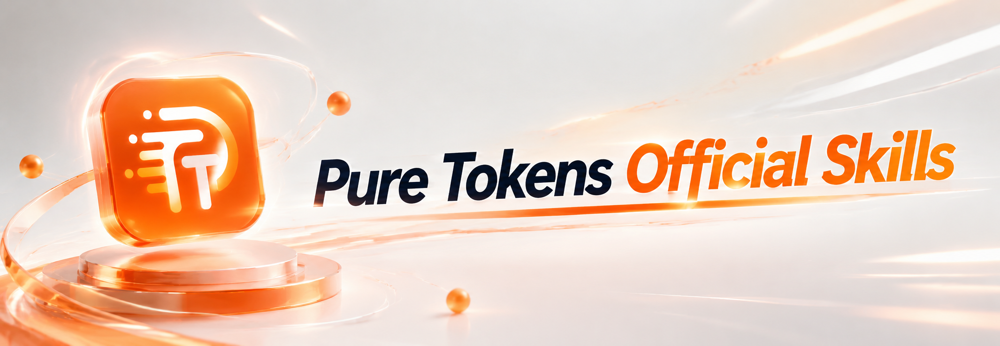

<p align="center">
  
</p>

# Pure Tokens Skills

Official Skills for checking a Pure Tokens connection, balance and model catalog, generating images or videos, and evaluating text with Jev.

Version 0.18.7 adds MiniMax Code Desktop for local macOS/Windows default connections. Standalone installation with Desktop preferences requires a confirmed target or the client runtime data-directory environment. See `references/switch-skill-compatibility.md` for the connection and session requirements.

## Agent-assisted installation

The one-line compatibility entry is preserved below. For explicit installation steps, copy the complete [Chinese](#chinese-installation-prompt) or [English](#english-installation-prompt) prompt.

### Copy this to a terminal-capable local agent

```text
Install or update the official Pure Tokens Skills from https://github.com/PureTokens/puretokens-skill.
```

### Chinese installation prompt

```text
请为我当前使用的客户端安装或更新 Pure Tokens 官方 Skills，仓库：https://github.com/PureTokens/puretokens-skill。

1. 阅读官方安装说明，只确定本次安装所需的当前客户端、官方宿主 ID 和执行环境。不要从模型名称或共享 Skill 目录猜客户端；无法确定时只问必要信息。需要能在该客户端实际使用的本机环境执行命令，遵守其执行审批；不支持或没有执行能力时说明并停止。

2. 首次安装，将以下官方稳定版入口下载为本地文件：
   macOS/Linux：https://github.com/PureTokens/puretokens-skill/releases/latest/download/puretokens-skill-fetch.sh
   Windows：https://github.com/PureTokens/puretokens-skill/releases/latest/download/puretokens-skill-fetch.ps1
   已安装时，按官方说明定位该客户端官方 Skill 同级 .puretokens-executor 中的 fetch 脚本，执行 update。不要将远程内容直接管道进 shell。

3. 替换下面的绝对路径、操作和宿主 ID 后执行一次；首次安装用 install，已有安装用 update：
   macOS/Linux：sh "<fetch脚本绝对路径>" <操作> --host <当前宿主ID>
   Windows：powershell.exe -NoProfile -ExecutionPolicy Bypass -File "<fetch脚本绝对路径>" <操作> -Host <当前宿主ID>
   自定义目录按官方说明附加 --target / -Target 绝对路径；Octop 必须指定当前工作区的 .octop/skills。由官方脚本选择当前系统和架构的稳定版包，校验并同步完整 Skills 与原生执行器。不要复制单个 SKILL.md、使用通用安装器或回退 main、源码包、镜像；不要为此安装 Node、npm、Python、Go、Git 或服务。

4. 保留现有连接和用户文件。不要自行读取、展示或修改认证配置，也不要索取或转述凭据；由原生执行器按当前宿主规则完成只读验证。下载、校验、执行权限或文件冲突失败时，报告已完成阶段与脱敏原因并停止；不自动删除、修复、重装、换宿主或改用其他执行方式。超时或输出不确定时不得猜测成功。

5. 复用脚本的同步与自动 init 结果，不另跑 init、doctor、余额或模型查询。自动 init 最多两次只读请求，共用 20 秒预算；安装成功而 init 失败应报告“安装已完成，连接验证未完成”。同版完整性校验通过的快速返回表示“已是当前稳定版且文件完整”，无需再下载、写入或初始化。

6. 完成后简要汇报实际客户端、实际安装版本、安装状态和连接验证状态（已验证／未验证／未执行）。按实际安装版本的本地使用指南列出可用能力，给出两条可复制的使用示例，仅展示、不执行。实际同步后提醒我新开对话加载 Skills；不要声称当前会话已经加载，不自动开始生成或付费体验。
```

### English installation prompt

```text
Install or update the official Pure Tokens Skills for the client I am currently using. Repository: https://github.com/PureTokens/puretokens-skill.

1. Read the official installation instructions and identify only the current client, its documented host ID and its execution environment. Do not infer the client from a model name or shared Skill directory; ask only for missing essential information. Commands must run in the local environment actually used by that client. Respect execution approvals; explain and stop if the environment is unsupported or cannot execute commands.

2. For a first installation, save the official stable-release entry point as a local file:
   macOS/Linux: https://github.com/PureTokens/puretokens-skill/releases/latest/download/puretokens-skill-fetch.sh
   Windows: https://github.com/PureTokens/puretokens-skill/releases/latest/download/puretokens-skill-fetch.ps1
   For an existing installation, follow the official instructions to locate the fetch script in .puretokens-executor alongside that client's official Skills and use update. Never pipe remote content directly into a shell.

3. Substitute the absolute path, operation and host ID below, then run once. Use install for a first installation or update for an existing installation:
   macOS/Linux: sh "<absolute-fetch-path>" <operation> --host <current-host-id>
   Windows: powershell.exe -NoProfile -ExecutionPolicy Bypass -File "<absolute-fetch-path>" <operation> -Host <current-host-id>
   For a custom directory, add the documented --target / -Target absolute path; Octop requires the current workspace's .octop/skills. Let the official script select, verify and synchronize the stable package for this OS and architecture, including the complete Skills and native executor. Do not copy only SKILL.md, use a generic installer, or fall back to main, source archives or mirrors. Do not install Node, npm, Python, Go, Git or services for this task.

4. Preserve existing connections and user files. Do not independently read, display or modify authentication configuration, or request or relay credentials; let the native executor perform the documented read-only verification for this host. On download, checksum, execution-permission or file-conflict failure, report the completed stage and sanitized cause, then stop. Do not automatically delete, repair, reinstall, switch hosts or use another execution path. A timeout or uncertain output does not establish success.

5. Reuse the script's synchronization and automatic init results. Do not add init, doctor, balance or model queries. Automatic init allows at most two read-only requests within one 20-second budget. Successful synchronization followed by failed init means “Installed; connection not verified.” A same-version verified fast return means “Already on the current stable version; files verified,” with no further download, writes or initialization.

6. Briefly report the actual client, installed version, installation status and connection verification status (verified / unverified / not run). List capabilities from that installed version's local usage guide and show two copyable examples without executing them. After actual synchronization, remind me to open a new conversation to load the Skills. Do not claim they are already loaded in this session or automatically start generation or a paid demo.
```

The agent saves the latest official stable release's `puretokens-skill-fetch.sh` (Windows: `.ps1`) locally and runs install with the current host ID. The fixed bootstrap URL is `https://github.com/PureTokens/puretokens-skill/releases/latest/download/puretokens-skill-fetch.sh`; Windows uses the `.ps1` suffix. Installed copies in `.puretokens-executor` provide check-update and update. Never pipe remote content into a shell or fall back to main, source archives or mirrors when stable assets are absent.

Installation boundary: after identifying the host, save the official fetch script locally and run it once. Let it pin the commit, download, verify, sync and initialize. Do not add full-script audits, PowerShell capability probes, duplicate inventory checks or doctor to ordinary installation. Respect required host approvals. On launch denial, unavailable output, timeout, download or verification failure, report the completed stage and sanitized failure, then stop. Do not create probes, shims or Python patches, modify official scripts, switch launch paths or retry automatically. Debugging requires a separate user request.

## What is installed

| Skill | Purpose |
| --- | --- |
| `puretokens-connection` | Verify the fixed Pure Tokens API identity without exposing configuration. |
| `puretokens-balance` | Check account wallet balance or the current Key's remaining allowance in USD. |
| `puretokens-models` | Read the authenticated current model catalog and declared capabilities. |
| `puretokens-image` | Generate images and perform declared image edits. |
| `puretokens-video` | Generate videos and use declared image/video/audio references or video edits. |
| `puretokens-audio` | Turn text into speech, transcribe recordings, generate sound scenes, or create music and songs. |
| `puretokens-evaluate` | Classify text, score against ordered criteria, or make yes/no judgments with Jev. |
| `puretokens-update` | Initialize, show usage guidance, and safely synchronize these official Skills. |

## How direct API generation works

The media Skills always use full fixed URLs under `https://api.puretokensx.com`: Images uses `/v1/images/generations`; Videos uses `/v1/videos`. They do not send media work to an arbitrary configured Base URL, MCP server, local proxy, sidecar, or a second endpoint.

Each request is performed by the single-file native executor installed with the Skills. It runs only for that command, connects to the fixed API, then exits; it does not start a port, background service, proxy, sidecar, or desktop automation. The executor reads only the active connection record at the supported host's documented configuration path, verifies that record targets Pure Tokens, and keeps one matching credential in memory for the fixed request. Pure Tokens Switch, CC Switch and manual configurations can use the exact records listed in `references/credential-adapters.md`; unpersisted project/session overrides are not verified. Neither the Skill nor the user passes a key or Base URL. It never scans home directories, checks a provider label, asks for, displays, stores, logs, or reports an API key, Base URL, or host configuration.

No Node, npm, Python, Go, Pure Tokens Desktop, MCP, or upload relay is required to generate media. The installer verifies and places the platform-native executor, which performs fixed requests, multipart attachments, same-task polling, and bounded native-media delivery. If validation or attachment preparation fails before POST starts, no task was submitted. Once POST may have started, a network or unreadable-response failure leaves the outcome unknown; the Skill preserves that uncertainty and never resubmits automatically.

Computer Use, browser automation, and opening or clicking Pure Tokens Switch/Desktop are not fallback execution paths. The Skills never use them to find a visible generation interface, obtain a credential, submit media, or deliver a result; they also never invoke another image or video Skill as a fallback.

## Audio

Ask “Read this text into an MP3,” “Transcribe this recording,” or “Generate rain
and footsteps.” `puretokens-audio` reuses the current connection for one
synchronous request, with a 90-second deadline and no polling or automatic retry.
It supports speech up to 1000 characters, MP3/WAV/OGG recordings up to 8 MiB, and
sound instructions up to 500 characters. Voices are reviewed per model; generated
MP3/WAV files require actual attachment handoff. Voice cloning, translation
and real-time conversation are not integrated. An unknown response does not prove
no charge; failed attachment handoff can reuse the locally verified original file.
Production calls, billing and real-host playback are tracked separately in the
maintenance acceptance record.

Music uses `stepaudio-3-music-preview` through the same Skill: describe an
instrumental piece or provide lyrics for a song. The executor submits once and
immediately returns a task receipt, then queries and downloads that same task
through separate commands. Descriptions are limited to 1000 characters, lyrics
to 4000; output is MP3/WAV up to 32 MiB. Explicit local task records support
continuation without storing descriptions or lyrics. Gateway files remain
available for 24 hours after storage; downloaded originals can be reattached
after local verification. Deploy the paired Web gateway music API-key patch
before enabling music requests. See `references/audio-execution-contract.md`.

Audio [scenario guidance](skills/puretokens-audio/references/prompt-guide.md)
separates spoken text, sound descriptions, music style and exact lyrics.
Explicit combined requests can use [bounded workflows](skills/puretokens-video/references/workflows.md):
generate an image and pass its unchanged local bytes as a supported video's first
frame, or generate video and independent narration/music assets. Each step has its
own progress and delivery; a later failure never restarts earlier tasks. These
workflows do not compose, edit or mix a finished video. Simple requests do not load
the workflow guide or add preflight calls.

## Jev text evaluation

Ask “Use Jev to classify this ticket as billing, technical, or other” or “Use Jev to judge urgency and score impact against these three levels.” The new `puretokens-evaluate` Skill uses one synchronous native request to the fixed `/typesafe/v1/systemone` endpoint. It reuses the current host's Pure Tokens connection; no TypeSafe SDK or additional key is needed. Independent questions over the same text share one request.

The default is `jev-latest`; reviewed exact alternatives are `jev-1.13.0` and `jev-preview`. Choice, Score and Noul return typed options/numbers and probabilities. Confidence is not validated accuracy or authorization for external actions. Inputs are text/structured text, not images/audio/video. Timeouts or invalid responses stop without automatic retries, polling or claims about charges. Explicit evaluation model discovery lists only reviewed IDs returned by `/v1/models`; listing does not prove the native endpoint is callable. See [evaluation contract](references/jev-evaluation-contract.md). Production and real-host evaluation acceptance remains unverified.

## Media routing

Image understanding, OCR, video analysis, screenshot troubleshooting, and prompt-only writing do not create media tasks. Model capability questions use model discovery; progress checks and result retrieval continue the existing task. The image and video entries include intent-to-operation tables, with scene prompt guides read only when needed. Verbatim prompts remain separate from actual output parameters, and attachment count alone does not imply first/last frames.

When the current host uses a Pure Tokens connection, ordinary image requests select `puretokens-image` before generic `imagegen`, Imagen, or other image Skills; ordinary video requests select `puretokens-video` before generic video Skills. This applies even when the user does not explicitly say “Pure Tokens.” Once selected, the Pure Tokens specialist either executes its fixed API path or stops safely; it never falls back to a generic media Skill.

The priority is carried by the installed Skill metadata and the host's current connection context. Only the native executor resolves one matching current-connection credential privately in memory for a fixed request; it never exposes or reports connection configuration. A host that ignores installed-Skill selection metadata must correct its own selection policy; a Skill cannot force another host or third-party Skill to change priority at runtime.

## Supported hosts

| Host | Skill directory | Direct execution |
| --- | --- | --- |
| Claude Code | `~/.claude/skills` | Credential fixtures tested; host end-to-end acceptance pending |
| Codex | `~/.agents/skills` | Credential fixtures tested; host end-to-end acceptance pending |
| WorkBuddy | `~/.workbuddy/skills` | Credential fixtures tested; host end-to-end acceptance pending |
| Gemini CLI | `~/.gemini/skills` | Credential fixtures tested; host end-to-end acceptance pending |
| Grok Build | `~/.grok/skills` | Credential fixtures tested; host end-to-end acceptance pending |
| OpenCode | `~/.config/opencode/skills` | Credential fixtures tested; host end-to-end acceptance pending |
| Trae / TraeWork (`trae`) | `~/.trae/skills` (legacy installation only) | No credential adapter; current TraeWork discovery is not verified |
| Claude Desktop | `~/.claude/skills` (shared with Claude Code) | Local Code sessions; Desktop credential fixtures tested, end-to-end acceptance pending |
| DSH Desktop | macOS: `~/Library/Application Support/dsh-desktop/harness/skills`; Windows: `%APPDATA%\dsh-desktop\harness\skills` | Credential fixtures tested; host end-to-end acceptance pending |
| Official DeepSeek Harness | `~/.dsh/skills` or absolute `DSH_HOME/skills` | Default local Desktop connection in 0.18.7 |
| MiniMax Code Desktop | `~/.minimax/skills` or the explicit runtime data directory | Default local session; confirm the install target when Desktop preferences exist |
| ZCode | `~/.zcode/skills` | Local connection adapter; real API and attachment delivery acceptance pending |
| Kimi Code | `~/.kimi-code/skills` | Credential fixtures covered; real API and attachment delivery pending |
| Qoder | `~/.qoder/skills` | Local IDE/CLI execution; real API and attachment delivery pending |
| Pi | `~/.pi/agent/skills` | Inline authentication precedence covered by fixtures; real API and attachment delivery pending |
| Hermes | `~/.hermes/skills`; Windows: `%LOCALAPPDATA%/hermes/skills` | Selected inline custom provider; pooled/dynamic authentication unsupported |
| EvoX | `~/.evox/agent/skills` | Canonical default-instance settings/auth fixtures; legacy stores unsupported |
| VS Code | `~/.copilot/skills` | Default local profile; one supported multi-model connection sharing one Key in 0.18.7 |
| Octop | Explicit current workspace `.octop/skills` target | Read-only local SQLite connection; no assumed global Skill installation |

Connection adapters have fixture coverage; real-host acceptance is recorded separately.
The [Switch × dedicated-task matrix](references/switch-skill-compatibility.md)
separates Skill execution, connection resolution, model permissions, API routing
and actual delivery. Audio/Jev command entries are included in 0.18.7; embedding/rerank have
no Skill entry. Configuring a client or listing a model does not verify a task.
Hermes and EvoX honor their documented absolute data-root overrides. Octop
requires `--host octop --target <absolute-workspace>/.octop/skills` (PowerShell:
`-HostId octop -Target <absolute-workspace>/.octop/skills`); do not enumerate
agents or write the global skill-package database. Cursor is not registered.

`references/host-support.json` defines the registered hosts. The table shows defaults; Claude/WorkBuddy honor explicit configuration-directory overrides, Pi honors an absolute `PI_CODING_AGENT_DIR` without parent traversal, and DSH honors the local Harness's explicit `DSH_HOME`. Gemini updates an existing higher-priority `.agents/skills` installation and reports managed duplicates. Provider labels never determine support.

Registration, installation, authenticated API access and complete media delivery are distinct. Real-host evidence records the client/OS/shell versions, architecture and execution mode; only a complete case set establishes image opening, video playback and attachment handoff for that exact environment. Consult `references/host-acceptance.json` for current per-case evidence; partial passes are not complete media acceptance. Local results do not accept WSL, remote or sandbox modes. See `references/host-acceptance-guide.md` for the procedure.

For Claude Desktop, use a local Code session and host ID `claude-desktop`; its active Desktop 3P connection is separate from Claude Code authentication. Cloud, SSH, WSL and Cowork isolated environments are not the local desktop; unavailable connection records or executors stop execution. DSH uses `dsh-desktop`; project/custom Skill roots may override user roots, so verify the loaded location. See the [desktop host guide](skills/puretokens-update/references/desktop-hosts.md).

## Images and videos

Normal generation reads only the selected profile for a default or exact model ID; the small index is needed only for model selection or alias resolution. It does not load every model or fetch the catalog before every task. `puretokens-image` defaults to `gpt-image-2.5-flare`; `puretokens-video` defaults to `minimax_h3`. An explicit user model choice takes precedence; an existing task retains its original model. The live catalog is read only when a user explicitly asks for current models, requests an option or media operation absent from the selected profile, or needs a post-rejection diagnosis.

A normal wait window ending means the task is still processing, not failed. The active authorized delivery can continue for one more bounded foreground window, then pauses for user input. Task records preserve this budget; errors, reconciliation and deferred retries stop automatic continuation. Videos, multiple outputs and cross-session work use explicit workspace task records by default. A failed attachment handoff reuses the verified existing file rather than submitting or downloading again.

Image and video tasks are asynchronous. Each submission creates at most one POST. Once a returned top-level task ID is known, the Skill polls and retrieves only that task. If a POST may have started but the task ID is missing, acceptance is unknown: it never submits a duplicate task or claims that no charge occurred. Image content is delivered sequentially from zero-based indexes `0..n-1`; video content is delivered only after terminal success.

For a local image, video, or audio attachment, the Skill sends the current attachment only in the exact declared multipart Images or Videos API operation. It never uploads to a separate service, rehosts media, turns attachment bytes into a prompt, or silently downgrades an image/video reference request to text generation. Public HTTPS URLs are passed only in profile-declared fields; file/voice IDs are not supported.

The selected installed profile governs ordinary requests. An explicit authenticated catalog query reports current declarations; catalog membership is not a required preflight or a substitute for the media API’s access decision. If the media API denies access, report that rejection and guide the user to check the connection’s model permissions without automatically resubmitting.

<!-- media-model-catalog:start -->
## Media model catalog

Synchronized with the base model catalog: 2026-10-04T06:19:22.134Z.

This list is an installed selection aid, not a per-request authorization check. Ordinary generation reads only the selected profile; live discovery is limited to explicit requests, profile gaps or rejection diagnosis. Reviewed local compatibility supplements are separately sourced.

README is generated only from base-catalog models with explicit image/video capabilities; it never infers capability from a model name. The installed model index selects a model and only that model's profile carries known parameters; the live catalog is read on demand only for explicit discovery, an installed-profile gap, or post-rejection diagnosis. Before release, refresh from the controlled base catalog and run `npm run release:validate`; the release gate fails when the snapshot is over seven days old.

### Image models

| Model ID | Provider | You can also say | Good for | Example |
| --- | --- | --- | --- | --- |
| `gpt-image-2` | OpenAI | `image2` | Image generation | `Use gpt-image-2 to generate an image.` |
| `gpt-image-2.5` | OpenAI | Exact ID only | Image generation | `Use gpt-image-2.5 to generate an image.` |
| `gpt-image-2.5-flare` | OpenAI | Exact ID only | Image generation | `Use gpt-image-2.5-flare to generate an image.` |
| `gpt-image-2.5-sunburst` | OpenAI | Exact ID only | Image generation | `Use gpt-image-2.5-sunburst to generate an image.` |
| `gpt-image-2(Sub)` | OpenAI | Exact ID only | Image generation | `Use gpt-image-2(Sub) to generate an image.` |
| `grok-imagine-image` | xAI | `grok image` | Image generation | `Use grok-imagine-image to generate an image.` |
| `grok-imagine-image-2.0` | xAI | `grok image 2.0` | Image generation | `Use grok-imagine-image-2.0 to generate an image.` |
| `grok-imagine-image-quality` | xAI | Exact ID only | Image generation | `Use grok-imagine-image-quality to generate an image.` |
| `nano-banana-2` | Google | `nano banana 2` | Image generation | `Use nano-banana-2 to generate an image.` |
| `nano-banana-2-lite` | Google | Exact ID only | Image generation | `Use nano-banana-2-lite to generate an image.` |
| `nano-banana-pro` | Google | `nano banana pro` | Image generation | `Use nano-banana-pro to generate an image.` |
| `qwen-image-3.0` | Qwen | Exact ID only | Image generation | `Use qwen-image-3.0 to generate an image.` |
| `qwen-image-3.0-pro` | Qwen | Exact ID only | Image generation | `Use qwen-image-3.0-pro to generate an image.` |
| `wan2.7-image` | Qwen | Exact ID only | Image generation | `Use wan2.7-image to generate an image.` |
| `wan2.7-image-pro` | Qwen | Exact ID only | Image generation | `Use wan2.7-image-pro to generate an image.` |

### Video models

| Model ID | Provider | You can also say | Good for | Example |
| --- | --- | --- | --- | --- |
| `grok-imagine-video` | xAI | `grok video` | Video generation | `Use grok-imagine-video to generate a video.` |
| `grok-imagine-video-1.5` | xAI | Exact ID only | Video generation | `Use grok-imagine-video-1.5 to generate a short video.` |
| `minimax_h3` | MiniMax | Exact ID only | Video generation | `Use minimax_h3 to generate a short video.` |
| `omni` | Google | Exact ID only | Video generation | `Use omni to generate a short video.` |
| `seedance-2.0` | ByteDance | Exact ID only | Video generation | `Use seedance-2.0 to generate a video.` |
| `seedance-2.0-fast` | ByteDance | Exact ID only | Video generation | `Use seedance-2.0-fast to generate a video.` |
| `seedance-2.0-mini` | ByteDance | Exact ID only | Video generation | `Use seedance-2.0-mini to generate a video.` |
| `seedance-2.5` | ByteDance | Exact ID only | Video generation | `Use seedance-2.5 to generate a video.` |
| `seedance2.0` | ByteDance | Exact ID only | Video generation | `Use seedance2.0 to generate a short video.` |
| `veo_fast` | Google | Exact ID only | Video generation | `Use veo_fast to generate a short video.` |
| `veo_lite` | Google | Exact ID only | Video generation | `Use veo_lite to generate a short video.` |
| `veo_quan` | Google | Exact ID only | Video generation | `Use veo_quan to generate a short video.` |
| `wan3.0-video` | Qwen | `wan3 video`, `wan 3 video` | Video generation | `Use wan3.0-video to generate a short video.` |
| `wan3.0-video-prime` | Qwen | `wan3 video prime`, `wan 3 video prime` | Video generation | `Use wan3.0-video-prime to generate a short video.` |

<!-- media-model-catalog:end -->

## Errors and receipts

Unreadable submission responses, missing task IDs at the declared location, and unsupported ID types or formats have distinct local categories. None alone proves that the server omitted an ID or failed to generate media. Diagnosis uses the executor version in the affected client's original receipt, not another computer's version, and never repeats a paid request just to collect diagnostics.

Machine receipts retain available model, task ID, original operation, state, safe parameters and progress. User-facing replies show only the useful status, actual attachment or actionable failure. Failures include a safe phase, public API code only when explicitly returned, HTTP status when returned, a sanitized message, and an action the user can take. The Skills never expose raw response bodies, request headers/bodies, internal URLs, credentials, or user media.

Error text comes from controlled categories; only recognized public codes
actually returned by the API are retained. Unknown codes and arbitrary server
error text are omitted. GIF validation checks complete frame data; WebM checks
container boundaries, video tracks and blocks. Damaged output is not reused.
Container checks do not replace opening/playing the actual host attachment.
Explicit resume of a reconciliation record reads the same task once, then uses
the newly confirmed status.

## Updating

`puretokens-update` resolves the latest published stable manifest and pins its version, source commit, selector and platform archive checksums. It downloads only the current OS/architecture archive, containing eight shared Skills, one executor and only the current system's scripts. Missing assets never fall back to main or a source archive. Check-update does not write files or run init. Same-version install/update verifies the release executor checksum and all nine managed inventories, then returns without archive download, writes or init. Missing/modified files or unresolved transactions stop without automatic repair. Explicit local source sync remains available for maintainers.

A fresh installation or actual update still runs init automatically, with at most two read-only requests sharing one 20-second deadline and no automatic retry. File synchronization and connection verification are reported separately; an init timeout does not roll back installation, trigger reinstallation or prove an invalid credential. A versioned synchronization receipt confirms a completed installation; a same-version verification receipt confirms the existing installation without changing files.

The source sync scripts are `runtime/puretokens-skill-install.sh` for macOS/Linux and `runtime/puretokens-skill-install.ps1` for Windows. They install, verify, and place the platform executor; users do not need Node, npm, Python, Go, or a package manager.

Each managed directory has a `.puretokens-managed.json` inventory of files and
checksums. Updates and interrupted recovery stop on added, changed or missing
files and symlinks, preserving existing contents. An unmarked directory
must match the current official source exactly; a matching name or self-reported version/hash is
insufficient. Inventories detect accidental edits, not malicious local tampering.

After a fresh installation or actual version update, the installer automatically runs `init`; an intact same-version shortcut does not. It performs a non-billable fixed `/v1` identity check followed by one authenticated `/v1/media/models` request within a shared 20-second deadline without displaying credentials or host configuration, then prints the current usage guide and examples. If verification does not complete, it reports a sanitized reason such as no active matching connection, missing credential, API rejection with its HTTP status, network failure, or an unconfirmed API identity; it never prints the configured URL, provider, or key. Ask to initialize Pure Tokens Skills or verify authentication to run `init` again explicitly. A general connection check uses only `connection` for public identity, not authentication. Installation diagnostics use `doctor`; help reads the local guide. Choose one intent, without chaining redundant checks.

## Development validation

Optional anonymous completion reporting is disabled by default. Explicit
`PTP_OPERATIONS_RECEIPTS=1` enables bounded installation, verified connection
and execution event counts, without account IDs, credentials, prompts or
configuration. Failed reporting never changes the operation result. See
[the receipt contract](references/operations-receipts-contract.md) for the
one-second send budget and the distinction between submission and delivery.

Maintainers can run:

```bash
npm run check
npm run release:validate
```

Maintain shared guidance in `references/desktop-hosts.md`,
`references/skill-fragments/host-binding.md` and the host registry, then run
`npm run docs:sync-guidance`. It produces eight self-contained installed copies
and entrypoint hashes; the engineering gate rejects drift. No user runtime is added.

PNG/JPEG download and reuse validate pixel data with a 33,554,432-pixel decode
limit. WebP checks complete containers and nonempty image chunks, not full
codec decoding. Model queries and submissions share combination rules; live
queries do not rewrite profiles or automatically relax installed enum/range
limits. Changed declarations require a compatible stable update.

## Executor receipts and acceptance

The 0.17 command flow is submit → immediate task ID → bounded wait/status → one-index content download → host attachment delivery. No per-generation balance, init, or catalog preflight is added. A downloaded file is not yet a delivered attachment. Request JSON files replace interactive stdin; see each media Skill’s executor-usage reference.

Balance uses the same API-key route as the official CC Switch integration: `GET https://console.puretokensx.com/api/product/console/api-keys/usage`, followed by one public `/api/product/console/status` read for the USD conversion ratio. No browser login is required. An unlimited Key returns account wallet balance; a limited Key returns its own remaining allowance. The default reply is one concise amount with its scope, without subscription quotas. Legacy billing placeholders are never used as money. Queries stop after at most two GETs within 30 seconds; failures show an actionable reason without inventing an amount.

The executor adds a missing `sk-` prefix in memory for this balance request, as CC Switch does during import. It leaves user configuration and media authentication unchanged. If balance returns 401/403 while other calls work, the Skill reports a balance-specific rejection and preserves the working connection.

`references/host-acceptance.json` distinguishes tested credential fixtures from real host acceptance. Local automated checks do not prove Windows/macOS host attachment delivery.

Follow `references/host-acceptance-guide.md` for the full host acceptance cases.
`npm run acceptance:validate` checks host/OS versions, executor hashes, evidence
files and outcomes. Checks without actual evidence remain pending.

Explicit request checks use `preflight` without submitting media. `doctor` combines local installation diagnostics with read-only connection checks; help-only questions read the installed usage guide without network access. Neither is a routine generation preflight. Optional task records in a user/workspace location support same-task resume and delivered-index tracking; they contain no credentials, prompt, reference URLs or media bytes.

Exact media quotations, server idempotency guarantees and lookup of unknown submissions require server capabilities not implemented here. Local validation and task records do not provide them.

ZCode: `--host zcode`; an absolute `ZCODE_DATA_BASE_DIR` selects `<base>/.zcode/skills`. One uniquely enabled Pure Tokens connection is required. This does not identify the conversation model; remote workspace Skill sync does not supply the executor or connection.

Maintainer build verification uses the exact toolchain in `runtime/executor/build-config.json`. `npm run executor:build` records source/build input identities and six artifacts; `npm run validate` checks them. `npm run release:validate` also rebuilds all six platforms into temporary directories and compares bytes. End users need neither Go nor Node.

Verified output reuse requires an explicit task record with matching file SHA-256, byte count and media type. Legacy records can resume the same task, but files without proofs must be preserved and fetched again into another output directory. Native image/video handoff remains a separate real-host acceptance item.
